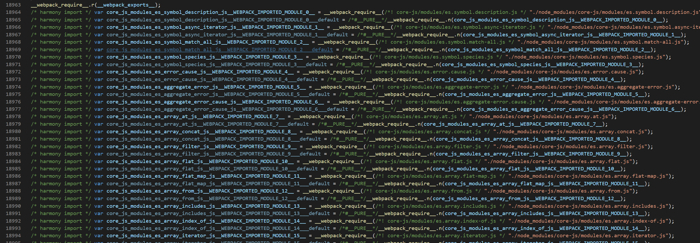
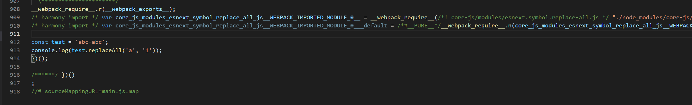

# babel-preset

## 有哪些 preset

https://babeljs.io/docs/en/presets/#official-presets

- @babel/preset-env for compiling **ES2015+ syntax**
- @babel/preset-typescript for TypeScript
- @babel/preset-react for React
- @babel/preset-flow for Flow

## preset-env options

https://babeljs.io/docs/en/babel-preset-env#corejs

> webpack 如何设置 preset-env？

```js
{
    loader: 'babel-loader',
    options: {
        presets: [
            [
                '@babel/preset-env',
                {
                    // options
                },
            ],
        ]
    }
}
```

### useBuiltIns 和 corejs

> When either the usage or entry options are used, @babel/preset-env will add direct references to core-js modules as bare imports (or requires). This means core-js will be resolved relative to the file itself and needs to be accessible.

当 useBuiltIns 设置了 usage 或者 entry，@babel/preset-env 将从 core-js 直接引用对应文件。

> Since @babel/polyfill was deprecated in 7.4.0, we recommend directly adding core-js and setting the version via the corejs option.

另外，使用 @babel/polyfill 已经是不推荐方式，需要配合使用 corejs 选项设置对应 polyfill。

**单一使用 useBuiltIns 会出现如下错误：**

```
WARNING (@babel/preset-env): We noticed you're using the `useBuiltIns` option without declaring a core-js version. Currently, we assume version 2.x when no version is passed. Since this default
version will likely change in future versions of Babel, we recommend explicitly setting the core-js version you are using via the `corejs` option.

You should also be sure that the version you pass to the `corejs` option matches the version specified in your `package.json`'s `dependencies` section. If it doesn't, you need to run one of the
following commands:

  npm install --save core-js@2    npm install --save core-js@3
  yarn add core-js@2              yarn add core-js@3

More info about useBuiltIns: https://babeljs.io/docs/en/babel-preset-env#usebuiltins
More info about core-js: https://babeljs.io/docs/en/babel-preset-env#corejs
```

#### entry 和 usage

```js
import 'core-js';

function test() {
  return new Promise((resolve, reject) => {
    const arr = [1, 2, 3, 4];
    return arr.map((item) => item * 2).includes(8);
  });
}
test().then((data) => {
  console.log(data);
});
```

import "core-js" 将导入 ECMAScript 所有的特性，这样即使 target 使用了最新的 chrome 版本，webpack 最终输出的文件也有近 530 KB（将近 11200 行），除非明确应用 core-js 下具体某些特性。

```
asset main.js 529 KiB [emitted] (name: main) 1 related asset
runtime modules 1.13 KiB 5 modules
modules by path ./node_modules/core-js/internals/*.js 142 KiB
  ./node_modules/core-js/internals/export.js 2.54 KiB [built] [code generated]
  ./node_modules/core-js/internals/global.js 590 bytes [built] [code generated]
  ./node_modules/core-js/internals/descriptors.js 308 bytes [built] [code generated]
  ./node_modules/core-js/internals/fails.js 108 bytes [built] [code generated]
  + 162 modules
modules by path ./node_modules/core-js/modules/*.js 128 KiB
  ./node_modules/core-js/modules/esnext.array.from-async.js 244 bytes [built] [code generated]
  ./node_modules/core-js/modules/esnext.array.filter-out.js 552 bytes [built] [code generated]
  ./node_modules/core-js/modules/esnext.array.filter-reject.js 531 bytes [built] [code generated]
  ./node_modules/core-js/modules/esnext.array.group-by.js 513 bytes [built] [code generated]
  ./node_modules/core-js/modules/esnext.array.group-by-to-map.js 1.4 KiB [built] [code generated]
  + 143 modules
./src/index.js 7.8 KiB [built] [code generated]
webpack 5.67.0 compiled successfully in 1485 ms
```

#### 使用 proposal 特性

默认 polyfill 将转化 ECMAScript 稳定的特性，如果想使用 proposal 能力，需要额外配置：

```js
{
    targets: {
        chrome: '97',
    },
    useBuiltIns: 'entry',
    corejs: '3.20',
}
```

```js
import 'core-js';

const test = 'abc-abc';
console.log(test.replaceAll('a', '1'));
```

即使 target 使用了最新的 chrome 版本，webpack 最终将 core-js 构建后的 polyfill 输出到了 11204 行代码。



当明确 pollyfill 哪些特性后，构建后的文件减小至 918 行。

```js
// import 'core-js';
import 'core-js/proposals/string-replace-all';
```


